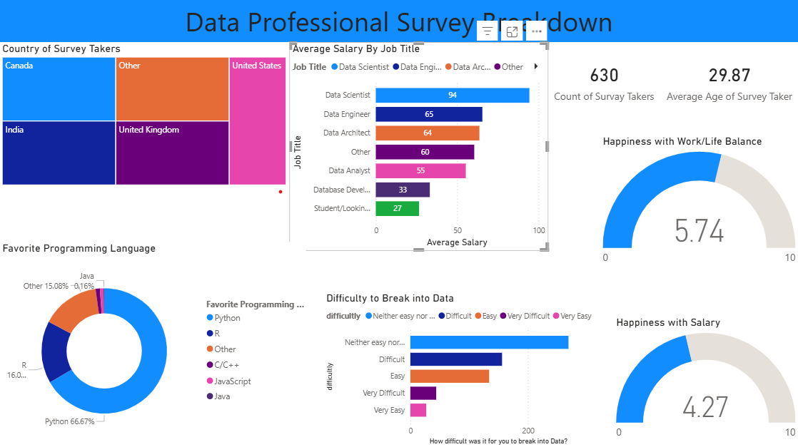

## Data Professional Survey Dashboard

This project analyzes survey responses from 630 data professionals to explore salary trends, skills, and career perceptions.

### Key Insights
- Data Scientists have the highest average salaries among surveyed roles
- Python is the most preferred programming language (66%)
- Most respondents find breaking into data roles neither easy nor difficult
- Salary satisfaction is relatively low (4.27/10) despite strong compensation

### Tools & Skills
- Power BI
- DAX
- Data Modeling
- Data Visualization

### Dashboard Preview

